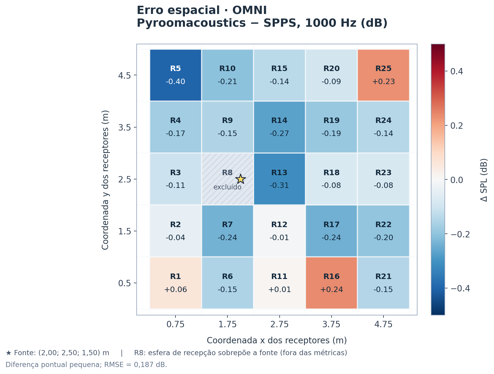
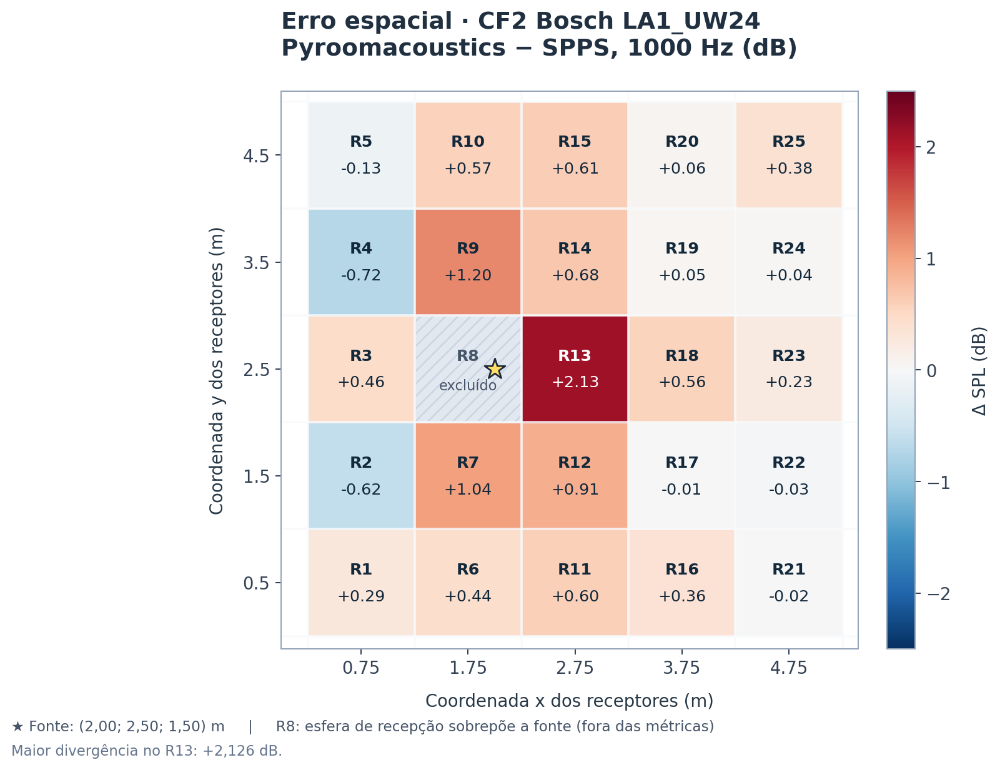
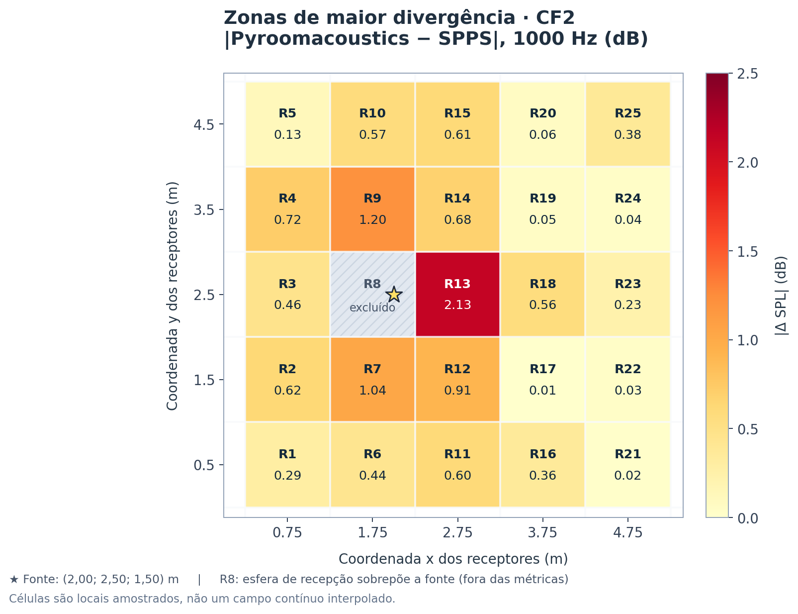
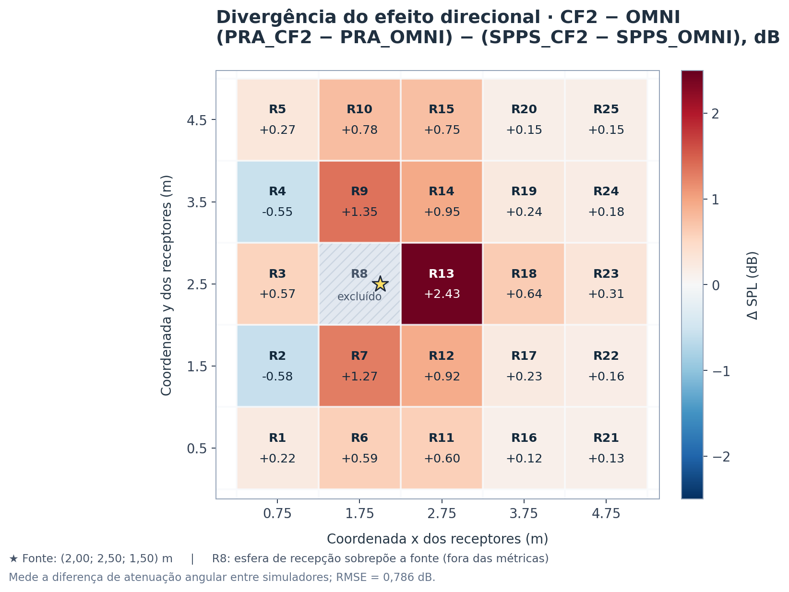

# Benchmark acústico: Pyroomacoustics × I-Simpa/SPPS

**Relatório técnico parcial — 09 de outubro de 2026**  
**Ensaio:** campo direto a 1000 Hz · fonte omnidirecional (OMNI) × diretividade CLF2 Bosch LA1_UW24  
**Status:** etapa OMNI e CF2-magnitude concluída; comparação SOFA TF/FIR planejada.

> **Síntese:** com uma calibração única do nível OMNI do Pyroomacoustics baseada na solução analítica de campo livre, o RMSE de nível por receptor frente ao SPPS foi de **0,187 dB para OMNI** e **0,691 dB para CF2**. A divergência entre os efeitos direcionais (CF2 − OMNI) foi **0,786 dB RMSE**, com correlação espacial de **0,9916**. A maior divergência CF2 apareceu em **R13: +2,126 dB**. Esses resultados dizem respeito a esta sala, a 1000 Hz e a uma grade horizontal de 25 receptores; não demonstram equivalência geral dos simuladores.

## 1. Objetivo e perguntas de pesquisa

Comparar **Pyroomacoustics 0.10.1 (PRA)** e **I-Simpa 1.3.4 / SPPS 2.2.1 (Windows 7)** em condições controladas e examinar duas perguntas:

1. **OMNI × OMNI:** os motores reproduzem níveis equivalentes no campo direto sem diretividade de fonte?
2. **CF2 × CF2:** a introdução do padrão real de diretividade do **Bosch LA1_UW24** produz a mesma distribuição espacial? 

Como desdobramento, pretende-se comparar representações e caminhos computacionais de Pyroomacoustics — **CF2 em bandas**, **SOFA FreeFieldDirectivityTF**, **SOFA GeneralFIR**, carregamento **Voronoi** e motores **nativo / 6G-E** — separando fidelidade acústica, custo de preparação e tempo de simulação. **As rotas SOFA ainda não foram executadas para este Bosch.**

## 2. Fontes e rastreabilidade

Os números deste relatório são derivados dos seguintes arquivos anexados e preservados nesta entrega:

| Fonte | Conteúdo / função |
|---|---|
| [`dados/comparison_25_receivers_original.csv`](dados/comparison_25_receivers_original.csv) | Níveis e erros em 25 receptores (PRA OMNI, PRA CF2 V5/FAST e SPPS OMNI/CF2). |
| [`dados/summary_original.json`](dados/summary_original.json) | Métricas agregadas, calibração aplicada, tempos e hashes das entradas do benchmark. |
| [`codigo/benchmark_pra_spps_m0.py`](codigo/benchmark_pra_spps_m0.py) | Implementação da comparação direta a 1000 Hz. |
| [`gerar_mapas.py`](gerar_mapas.py) | Recriação dos mapas de calor a partir do CSV original, sem suavização/interpolação espacial. |

O CSV recebido contém **25 registros de receptores e 174 linhas vazias adicionais**; essas linhas foram ignoradas ao calcular os mapas e tabelas. Nenhum receptor real foi descartado. O arquivo original foi preservado sem alterações.

**Identificadores documentados:**

- CF2 Bosch utilizado pela fase PRA, SHA-256: `6a972321f3ab7f4875f5b5f7c206ba7eeeb7f9a3f1d991bb01084173a3ee1668`.
- CSV SPPS OMNI, SHA-256: `e28d08ced90ff1e107c7393e2f2a64eb8124710fd7179586a4ea26ab5f8c0e01`.
- CSV SPPS CF2-SIGNED, SHA-256: `d49c6573292c3d2c4249711fe590e74381b335fe69541920bc8ca154c9125812`.
- CSV comparativo desta entrega, SHA-256: `9b1c015f87a6f4fc33f17d7b85a004350c574990c0913f3e06ba973aff9c7fa8`.

O SPPS foi executado **em Windows 7**; a instalação Linux de I-Simpa/SPPS foi examinada anteriormente, mas **não é a referência SPPS utilizada nesta comparação**.

## 3. Cenário e equivalência experimental

| Configuração | I-Simpa / SPPS (Windows 7) | Pyroomacoustics (Ubuntu) |
|---|---|---|
| Sala retangular | 6,0 × 5,0 × 3,0 m | 6,0 × 5,0 × 3,0 m |
| Posição da fonte | (2,0; 2,5; 1,5) m | Mesma coordenada |
| Orientação CF2 | eixo frontal +X | frente +X, esquerda +Y, topo +Z |
| Receptores | 25; grade 5×5 | Mesmas 25 coordenadas lidas do SPPS |
| Posição dos receptores | x={0,75; 1,75; 2,75; 3,75; 4,75} m; y={0,5; 1,5; 2,5; 3,5; 4,5} m; z=1,5 m | Iguais |
| Raio de recepção | 0,31 m (esfera SPPS) | Microfones pontuais |
| Potência sonora SPPS a 1000 Hz | 65,686 dB nos dois ensaios | Escala definida por uma única calibração OMNI; veja §4 |
| Faixa comparada | 1000 Hz | Função de transferência do RIR em 1000 Hz |
| Reflexões | Campo direto apenas | `max_order=0` |
| Partículas e semente | 150.000; 1234 | Não aplicável ao ISM determinístico |
| Método / integração SPPS | Energetic; 2 s; Δt=0,01 s | ISM; `compute_rir()` |
| Frequência de amostragem | Não se aplica da mesma forma ao relatório por bandas do SPPS | 16 kHz |
| Bandas internas PRA | — | 125, 250, 500, 1000, 2000, 4000, 8000 Hz |

Nos arquivos de Windows, `mesh.cbin` e `tetramesh.mbin` foram verificados como **idênticos** entre SPPS-OMNI e SPPS-CF2. A malha tem **6 tetraedros e 8 nós**. Os dois ensaios SPPS registraram energia nos 25 receptores. Absorção atmosférica, difusão e transmissão estavam desativadas; o campo direto estava ativado.

**Receptor R8:** situado em (1,75; 2,50; 1,50) m, a **0,25 m** da fonte — distância inferior ao raio de 0,31 m. Por isso, aparece em mapas e tabelas como *excluído*, mas não participa das métricas globais (N=24). A exclusão é aplicada simetricamente às comparações OMNI e CF2.

## 4. Procedimento de processamento e fórmulas

### 4.1. Nível obtido pelo RIR em Pyroomacoustics

Para o RIR numérico de cada receptor, o executador avalia a transferência complexa em uma frequência específica, a partir da transformada discreta do RIR:

$$
H_i(f)=\sum_n h_i[n]e^{-j2\pi fn/f_s},\qquad f=1000\,\mathrm{Hz}.
$$

O nível relativo é calculado como $20\log_{10}|H_i(1000)|$. Para convertê-lo à escala em decibéis usada nesta comparação, foi aplicado **um único deslocamento escalar**, ajustado no caso OMNI contra a solução analítica de fonte pontual:

$$
C=\operatorname{mediana}_{i\ne 8}\left[L_{p,i}^{\mathrm{livre}}-20\log_{10}|H_i^{\mathrm{OMNI}}(1000)|\right].
$$

Valor calculado: **$C=54,713182$ dB**. O **mesmo** $C$ foi aplicado a CF2 V5 e CF2 FAST, sem reajuste contra SPPS-CF2. Assim, a concordância em nível absoluto **depende da calibração teórica OMNI**, não de uma correspondência instrumental independente de SPL entre os dois motores.

### 4.2. Entrada CF2 e tratamento da diretividade

O **CF2 v1** do Bosch LA1_UW24 contém informação de **magnitude** em uma grade angular de **72 rotações × 37 arcos** (passo de 5°). Neste experimento, os adaptadores usam os valores de ganho do CF2 **sem inverter o sinal**, com interpolação angular bilinear em dB, e transformam ganho de nível em ganho de amplitude por $10^{D/20}$.

A orientação utilizada é **+X frontal, +Y esquerda, +Z superior**. A versão `PRA_CF2_V5_16K` lê a matriz pelo parser v5; a versão `PRA_CF2_FAST_16K` reproduz esse modelo com implementação vetorizada. Esses resultados **não** usam o arquivo EASE intermediário, que foi necessário apenas para importar a diretividade no I-Simpa.

**Limitação:** o arquivo CF2 v1 não oferece fase medida para esse alto-falante. Futuras conversões TF/FIR que acrescentem fase precisam identificá-la como **sintética/modelada**, e não como medição física do fabricante.

### 4.3. Métricas

Para cada receptor $i$ e representação $m$ de PRA:

$$
\varepsilon_i^{m}=L_{p,i}^{\mathrm{PRA},m}-L_{p,i}^{\mathrm{SPPS},m},\quad
\mathrm{RMSE}=\sqrt{\frac1{24}\sum_{i\ne8}(\varepsilon_i)^2}.
$$

O erro entre efeitos direcionais remove a calibração absoluta comum de PRA:

$$
\Delta_i=\big(L_{p,i}^{\mathrm{PRA,CF2}}-L_{p,i}^{\mathrm{PRA,OMNI}}\big)
-\big(L_{p,i}^{\mathrm{SPPS,CF2}}-L_{p,i}^{\mathrm{SPPS,OMNI}}\big).
$$

O viés é a média **assinada** do erro; o MAE é a média do valor absoluto, e o RMSE penaliza mais as grandes diferenças locais.

## 5. Resultados numéricos

### 5.1. Concordância entre simuladores

| Método PRA comparado com a respectiva referência SPPS | RMSE (dB) | MAE (dB) | Viés (dB) | Erro absoluto máx. (dB) | `compute_rir` (s)¹ |
|---|---:|---:|---:|---:|---:|
| PRA — OMNI, 16 kHz | 0,187 | 0,162 | -0,118 | 0,400 | 0,270 |
| PRA — CF2 V5, 16 kHz | 0,691 | 0,505 | +0,378 | 2,126 | 0,244 |
| PRA — CF2 FAST, 16 kHz | 0,691 | 0,505 | +0,378 | 2,126 | 0,367 |

¹ **Tempos de uma execução**, sem aquecimento/balanceamento estatístico. Não permitem concluir superioridade de desempenho entre os métodos.

Os dois adaptadores CF2 de PRA concordaram até aproximadamente **3,49 × 10⁻⁷ dB** de diferença máxima nos níveis de 25 receptores. A vetorização **não alterou de modo perceptível a resposta acústica** desta etapa.

### 5.2. Efeito da diretividade CF2 em cada motor

| Indicador (24 receptores) | Resultado |
|---|---:|
| RMS da variação de nível CF2 − OMNI em SPPS (não é erro) | 6,560 dB |
| Média do efeito CF2 − OMNI em SPPS | -4,912 dB |
| **RMSE entre os efeitos direcionais PRA e SPPS** | **0,786 dB** |
| MAE entre os efeitos direcionais | 0,590 dB |
| Viés do erro entre efeitos direcionais | +0,496 dB |
| Erro máximo entre efeitos direcionais | 2,434 dB |
| Correlação de Pearson entre padrões espaciais (efeitos CF2 − OMNI) | **0,9916** |
| RMSE do efeito PRA-CF2 contra o ganho angular CF2 de entrada | **0,084 dB** |

A correlação espacial elevada indica que os **padrões relativos** CF2 − OMNI têm formato semelhante nas 24 posições observadas. Ela **não implica equivalência física em todo o espaço 3D**, nem prova que as implementações de fonte ou receptor tenham normalização energética idêntica.

### 5.3. Principais pontos de divergência

| Receptor | (x; y) em m | Erro CF2 PRA − SPPS (dB) | Erro entre efeitos CF2 − OMNI (dB) |
|---|---|---:|---:|
| R13 | (2,750; 2,500) | +2,126 | +2,434 |
| R9 | (1,750; 3,500) | +1,203 | +1,354 |
| R7 | (1,750; 1,500) | +1,035 | +1,272 |
| R12 | (2,750; 1,500) | +0,911 | +0,922 |
| R4 | (0,750; 3,500) | -0,722 | -0,547 |
| R14 | (2,750; 3,500) | +0,683 | +0,949 |
| R2 | (0,750; 1,500) | -0,618 | -0,575 |
| R15 | (2,750; 4,500) | +0,614 | +0,750 |

**Interpretação observacional:** a maior divergência ocorre no **R13** (na direção frontal +X, a 0,75 m da fonte), e aparecem diferenças intermediárias em R7 e R9, próximos à região lateral/posterior da fonte. A proximidade do receptor, o raio SPPS de 0,31 m, a interpolação direcional e o método energético de partículas são **hipóteses explicativas**, ainda não isoladas por testes específicos.

### 5.4. Ensaios anteriores de I-Simpa/SPPS e controle de sinal

O experimento **SPPS-M0-OMNI**, antes da comparação entre simuladores, apresentou **RMSE de 0,193 dB** contra a expressão analítica de campo livre (24 receptores válidos). Esse valor foi obtido no próprio SPPS e **não deve ser confundido** com o RMSE PRA−SPPS de 0,187 dB reportado na Tabela 5.1.

A primeira importação EASE/CF2 no Windows, com as atenuações **invertidas para valores positivos**, produziu um aumento médio CF2−OMNI de **+5,213 dB**. A versão posterior, **CF2-SIGNED**, preservou os valores angulares negativos e produziu **−4,912 dB** de variação média no conjunto de 24 receptores. A primeira versão foi preservada apenas como **diagnóstico de convenção de sinal**; a segunda compõe a referência CF2 da comparação principal. O resultado de CF2-SIGNED **não pode ser julgado pela divergência contra uma fonte OMNI analítica**, pois seu padrão direcional é intencionalmente distinto.

## 6. Mapas de calor espaciais — onde os simuladores divergem

Cada célula abaixo representa **um dos 25 receptores medidos** na seção horizontal $z=1,5$ m, **não uma simulação contínua nem uma interpolação entre pontos**. O asterisco indica a fonte em (2; 2,5) m. **R8** é mostrado com hachuras, excluído dos indicadores estatísticos.

### 6.1. Erro de nível — OMNI × OMNI

O erro OMNI concentra-se em uma faixa pequena, com **RMSE de 0,187 dB** e módulo máximo de **0,400 dB** (R5). Assim, neste ensaio a referência de propagação omnidirecional apresentou boa concordância após a calibração descrita no §4. A calibração foi calculada com o caso OMNI, portanto este indicador **não constitui uma verificação de SPL absoluto independente**.

### 6.2. Erro de nível — CF2 × CF2

As maiores divergências localizam-se em **R13 (+2,126 dB)**, **R9 (+1,203 dB)** e **R7 (+1,035 dB)**. Em R2 e R4 o erro é negativo (aproximadamente −0,618 e −0,722 dB). O mapa evidencia um comportamento **não uniforme**, incompatível com descrever a diferença CF2 como apenas um deslocamento fixo entre os simuladores.

### 6.3. Magnitude do erro CF2 — identificação de regiões críticas

Este mapa apresenta $|L_{PRA,CF2}-L_{SPPS,CF2}|$ para facilitar a identificação visual dos receptores de maior divergência independentemente do sinal. As regiões coloridas são **amostras da grade**, não áreas contínuas cuja precisão tenha sido avaliada.

### 6.4. Divergência específica do efeito da diretividade

Este é o mapa **mais relevante para validar o comportamento direcional**, pois compara o efeito de trocar OMNI por CF2 dentro de cada simulador. O valor máximo é **+2,434 dB no R13**, e o RMSE é **0,786 dB**. O deslocamento escalar de calibração PRA é cancelado nesta diferença de diferenças.

## 7. Discussão e limitações

**Achados sustentados pelos dados**

- A comparação OMNI apresenta **RMSE de 0,187 dB** após a calibração teórica única.
- Para o CF2, os dois adaptadores de Pyroomacoustics concordam numericamente e apresentam **RMSE de 0,691 dB** frente ao SPPS-CF2-SIGNED.
- A diferença entre os efeitos direcionais tem **RMSE de 0,786 dB** e correlação espacial de **0,9916**.
- O maior desvio de CF2 e do efeito direcional ocorre no **R13**.
- Os resultados não apontam um erro uniforme de ganho: a divergência depende da posição do receptor.

**O que ainda não está demonstrado**

- **Equivalência física absoluta de potência sonora:** o arquivo CF2 expressa uma magnitude relativa à direção; o efeito da normalização hemisférica/esférica da potência em cada implementação ainda deve ser caracterizado. A igualdade do valor numérico de Lw em SPPS não garante, por si só, equivalência com a amplitude de fonte em PRA.
- **Atribuição causal:** não se pode afirmar que R13 difira devido ao raio receptor, à discretização de SPPS ou à interpolação CF2 sem ensaios que variem cada fator separadamente.
- **Validade 3D/banda larga:** todos os receptores estão em $z=1,5$ m e a comparação é de **1000 Hz**; não foi avaliada uma malha volumétrica de medições, nem a resposta em todas as frequências do Bosch.
- **Equivalência de métricas:** SPPS integra contribuições energéticas registradas por receptores esféricos, enquanto PRA avalia uma transferência complexa do RIR no ponto. A referência comum ainda é metodológica, não uma igualdade exata de estimadores.
- **Desempenho computacional:** tempos de uma única rodada não são evidência estatística de qual método é mais rápido. Além disso, a duração da execução SPPS e o `compute_rir()` de PRA medem escopos computacionais diferentes.

**Sobre a importação EASE em I-Simpa:** a primeira exportação CF2 com sinal invertido produziu aumentos expressivos de nível incompatíveis com a interpretação pretendida das atenuações CF2 e foi tratada como ensaio diagnóstico. A referência **SPPS-CF2-SIGNED**, usada aqui, conserva as atenuações negativas do CF2; a interpretação de sinais e ângulos foi considerada plausível pela resposta observada, mas requer ensaios direcionais adicionais antes de uma validação definitiva.

**Sobre versões:** a execução de SPPS neste relatório é a de **Windows 7 / I-Simpa 1.3.4 / SPPS 2.2.1**, sem misturar os resultados divergentes obtidos anteriormente em uma imagem Linux de I-Simpa com identidade de compilação não homologada.

## 8. Próximos experimentos propostos

**Prioridade 1 — controle de divergências:** repetir OMNI/CF2 nas mesmas condições; inspecionar R13; executar testes de sensibilidade ao raio de recepção SPPS (mantendo todos os demais parâmetros) e uma varredura de orientação (+X, +Y, −X). Incluir receptores em alturas diferentes para observar padrões verticais do Bosch.

**Prioridade 2 — novos formatos Bosch:** gerar e verificar `FreeFieldDirectivityTF` e `GeneralFIR` **a partir do mesmo LA1_UW24.CF2**. Para CF2 v1, qualquer informação de fase será **sintética**, explicitamente identificada no método. Confirmar ganho em 1000 Hz, orientação, resposta causal e eventual atraso de FIR.

**Prioridade 3 — multiformatos com mesmos dados:** executar os casos do antigo experimento 6M em campo direto (`max_order=0`) e grade SPPS, sem importar os resultados numéricos de AXYS4549 em sala reflectante. A matriz planejada inclui CF2 FAST e versões SOFA TF/FIR em 16/48 kHz, com e sem Voronoi e com motores nativo ou 6G-E; comparar erros acústicos, preparação, tempo e memória separadamente.

**Prioridade 4 — avaliação estatística:** realizar rodadas balanceadas com aquecimento controlado, registrar CPU, threads, distribuição do tempo e dispersão (mediana, média, desvio, percentis). Evitar comparar diretamente tempos que não incluem as mesmas operações.

## 9. Matriz de acompanhamento

| Caso | Situação em 09/10/2026 |
|---|---|
| SPPS-OMNI, Windows 7 | **Executado**, referência experimental |
| SPPS-CF2-SIGNED, Windows 7 | **Executado**, referência direcional provisória |
| PRA-OMNI-16K | **Executado**, comparado a SPPS OMNI |
| PRA-CF2-V5-16K | **Executado**, comparado a SPPS CF2 |
| PRA-CF2-FAST-16K | **Executado**, comparado a SPPS CF2 |
| SOFA_TF_FAST_16K / SOFA_FIR_FAST_16K | **Pendente**, preparar SOFA Bosch |
| SOFA_FIR_VORONOI_FAST_16K / SOFA_FIR_NATIVE_16K | **Pendente**, preparar SOFA Bosch |
| SOFA_TF_FAST_48K / SOFA_FIR_FAST_48K | **Pendente**, preparar SOFA Bosch |
| SOFA_FIR_VORONOI_FAST_48K / SOFA_FIR_NATIVE_48K | **Pendente**, preparar SOFA Bosch |

## 10. Tabela completa — 25 receptores a 1000 Hz

Os valores de SPL e erros são expressos em dB. A coluna *Δ direcional* registra a diferença entre efeitos CF2 − OMNI; portanto não é sinônimo de erro absoluto CF2.

| Receptor | x (m) | y (m) | SPPS OMNI | PRA OMNI | SPPS CF2 | PRA CF2 V5 | Δ CF2 PRA−SPPS | Δ direcional |
|---|---:|---:|---:|---:|---:|---:|---:|---:|
| R1 | 0,750 | 0,500 | 47,187 | 47,247 | 36,279 | 36,564 | +0,285 | +0,225 |
| R2 | 0,750 | 1,500 | 50,623 | 50,580 | 35,505 | 34,887 | -0,618 | -0,575 |
| R3 | 0,750 | 2,500 | 52,847 | 52,741 | 44,990 | 45,450 | +0,460 | +0,566 |
| R4 | 0,750 | 3,500 | 50,755 | 50,580 | 35,609 | 34,887 | -0,722 | -0,547 |
| R5 | 0,750 | 4,500 | 47,647 | 47,247 | 36,690 | 36,564 | -0,126 | +0,275 |
| R6 | 1,750 | 0,500 | 48,760 | 48,606 | 42,848 | 43,284 | +0,436 | +0,589 |
| R7 | 1,750 | 1,500 | 54,693 | 54,456 | 46,939 | 47,974 | +1,035 | +1,272 |
| R8¹ | 1,750 | 2,500 | 68,473 | 66,711 | 55,413 | 59,463 | +4,050 | +5,813 |
| R9 | 1,750 | 3,500 | 54,606 | 54,456 | 46,770 | 47,974 | +1,203 | +1,354 |
| R10 | 1,750 | 4,500 | 48,812 | 48,606 | 42,711 | 43,284 | +0,573 | +0,779 |
| R11 | 2,750 | 0,500 | 48,127 | 48,135 | 44,345 | 44,949 | +0,604 | +0,596 |
| R12 | 2,750 | 1,500 | 52,752 | 52,741 | 49,448 | 50,359 | +0,911 | +0,922 |
| R13 | 2,750 | 2,500 | 57,541 | 57,232 | 55,107 | 57,232 | +2,126 | +2,434 |
| R14 | 2,750 | 3,500 | 53,007 | 52,741 | 49,676 | 50,359 | +0,683 | +0,949 |
| R15 | 2,750 | 4,500 | 48,271 | 48,135 | 44,335 | 44,949 | +0,614 | +0,750 |
| R16 | 3,750 | 0,500 | 45,942 | 46,179 | 43,622 | 43,978 | +0,355 | +0,118 |
| R17 | 3,750 | 1,500 | 48,845 | 48,606 | 47,331 | 47,325 | -0,006 | +0,233 |
| R18 | 3,750 | 2,500 | 49,939 | 49,862 | 49,301 | 49,862 | +0,561 | +0,638 |
| R19 | 3,750 | 3,500 | 48,796 | 48,606 | 47,271 | 47,325 | +0,054 | +0,244 |
| R20 | 3,750 | 4,500 | 46,272 | 46,179 | 43,916 | 43,978 | +0,061 | +0,154 |
| R21 | 4,750 | 0,500 | 44,199 | 44,052 | 42,557 | 42,540 | -0,016 | +0,131 |
| R22 | 4,750 | 1,500 | 45,554 | 45,358 | 44,785 | 44,750 | -0,035 | +0,161 |
| R23 | 4,750 | 2,500 | 46,011 | 45,930 | 45,703 | 45,930 | +0,227 | +0,308 |
| R24 | 4,750 | 3,500 | 45,501 | 45,358 | 44,714 | 44,750 | +0,036 | +0,179 |
| R25 | 4,750 | 4,500 | 43,823 | 44,052 | 42,162 | 42,540 | +0,378 | +0,149 |

¹ **R8:** registro mostrado para transparência, mas excluído dos resumos e das cores dos mapas de calor devido à sobreposição com a fonte.

## 11. Conclusão parcial

Na sala de 6×5×3 m, em campo direto e a 1000 Hz, a comparação **OMNI** resultou em diferenças reduzidas entre Pyroomacoustics e SPPS, com RMSE de **0,187 dB** após uma calibração analítica comum. A comparação **CF2** apresentou RMSE de **0,691 dB**, com padrão espacial semelhante entre motores e maior divergência localizada em **R13**. Os adaptadores CF2 V5 e FAST de Pyroomacoustics produziram resultados numericamente equivalentes nesse cenário. A comparação dos efeitos CF2 − OMNI, que elimina o deslocamento comum de calibração PRA, apresentou RMSE de **0,786 dB** e correlação **0,9916**.

O resultado constitui um **marco experimental parcial** para o benchmark PRA × SPPS. A conclusão final requer avaliação das diferenças entre esfera receptora e ponto, validação adicional de orientação/normalização, ampliação em frequência e execução dos métodos SOFA derivados do mesmo Bosch.
