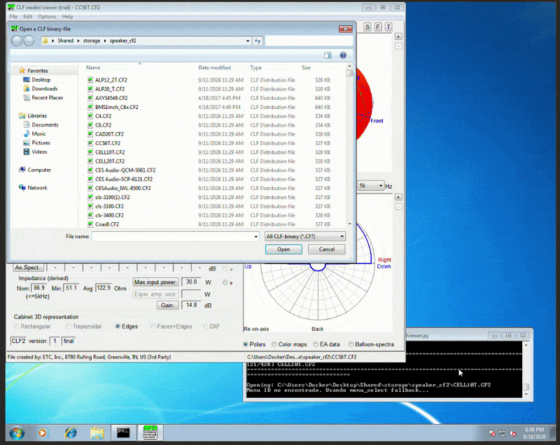
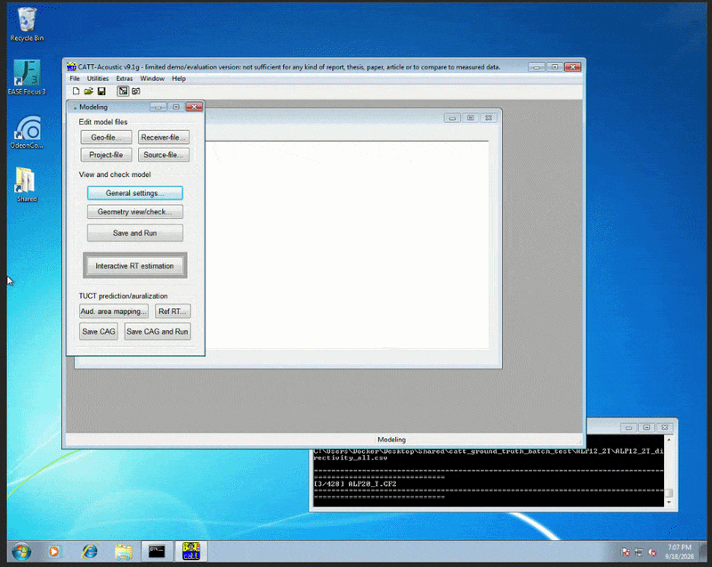

# Engenharia reversa do formato CF2

> Documentação técnica do processo de extração, análise e validação de
> arquivos `.CF2` utilizando dados do CLF Viewer e CATT-Acoustic.

## 1. Contexto e objetivo

Durante o desenvolvimento do trabalho surgiu a necessidade de acessar
diretamente os dados armazenados em arquivos `.CF2`. Como o formato é
binário e sua estrutura interna não é suficientemente documentada para
os campos necessários, foi realizada uma engenharia reversa baseada em
validação cruzada.

Foram utilizadas três fontes principais:

-   arquivos originais `.CF2`;
-   dados estruturados do CLF Viewer em `.json`;
-   diretividades extraídas do CATT-Acoustic em `.csv`.

A ideia não foi apenas encontrar offsets que funcionassem em alguns
arquivos, mas verificar as hipóteses em um conjunto grande de modelos e
fabricantes.


## 2. Formação do conjunto de dados

O conjunto inicial possuía 428 modelos. Para cada modelo foram buscados
o CF2 original, o JSON correspondente e o CSV de diretividade.

Como os nomes nem sempre coincidiam, foi criado um identificador
canônico, removendo diferenças de caixa, acentos, extensão e caracteres
especiais.

O registro final apresentou:

``` text
428 arquivos CF2 catalogados
428 registros JSON
428 arquivos CSV de diretividade

296 correspondências exatas
131 correspondências por normalização
427 conjuntos completos utilizáveis
```

Os dados foram separados em:

``` text
DISCOVERY = 296 modelos
VERIFY    = 131 modelos
```

O grupo `DISCOVERY` foi usado para formular hipóteses e o `VERIFY` para
verificar se elas continuavam funcionando fora do conjunto usado na
descoberta.

## 3. Extração dos dados do CLF Viewer

O CLF Viewer foi utilizado como referência externa para metadados e
parâmetros eletroacústicos.

Entre os campos coletados estavam modelo, fabricante, tipo, peso,
distância de medição, limite máximo de entrada, frequências, tensão,
sensibilidade, impedância, cobertura horizontal e vertical, Q axial e
espectro axial.

Os dados foram organizados em JSON para facilitar a comparação
automática com os valores encontrados no binário.



O JSON foi tratado como referência de comparação, e não como
especificação oficial do CF2. Isso foi importante porque alguns valores
apresentados pela interface estavam arredondados.

O codigo em python que realiza a extração dos dados é <a href="./scripts/read_files_cf2_from_cflviewer.py"
   target="_blank"
   rel="noopener noreferrer">
  Automação e captura no CLF Viewer
</a>

## 4. Extração das diretividades no CATT-Acoustic

O segundo conjunto de referência foi construído com o CATT-Acoustic.

Foram utilizadas oito oitavas:

``` text
125, 250, 500, 1000, 2000, 4000, 8000 e 16000 Hz
```

Para cada frequência foram percorridas 36 rotações, em passos de 10°, e
19 arcos, de 0° a 180° em passos de 10°.

Isso resultou em:

``` text
36 rotações × 19 arcos × 8 frequências
= 5472 pontos por modelo
```




Como o CATT não fornecia diretamente todos os valores numéricos da
curva, os pontos foram reconstruídos geometricamente a partir do gráfico
polar.

A calibração obtida foi aproximadamente:

``` text
raio de 0 dB    = 143 px
raio de -50 dB  = 12 px
passo dos anéis ≈ 26,2 px
```

com:

``` python
db = 10 * (radius_px - r0_px) / ring_step_px
```
 
O codigo em python que realiza a extração dos dados é <a href="./scripts/catt_batch_cf2_extract_v8_rot_outer.py"
   target="_blank"
   rel="noopener noreferrer">
  Automação e captura no CATT-Acoustic
</a>

## 5. Análise inicial dos offsets

Os arquivos CF2 foram analisados como estruturas binárias little-endian,
testando interpretações como `uint32`, `float32`, strings fixas e arrays
consecutivos.

Alguns offsets identificados foram:

    Offset Interpretação
  -------- -------------------------------
       `4` versão do formato
     `312` modelo
     `568` fabricante
    `1596` peso
    `2928` distância
    `2932` tipo
    `3704` modo do limite de entrada
    `3708` valor do limite
    `4624` índice da primeira frequência
    `4628` índice máximo declarado


A tabela global identificada contém 30 frequências, de 25 Hz a 20 kHz.

## 6. Arrays eletroacústicos

Foram encontrados vários arrays de 30 valores `float32`:

``` text
4096  axial spectrum
4632  input voltage
4752  sensitivity
4872  impedance
4992  horizontal left
5112  horizontal right
5232  vertical up
5352  vertical down
5472  axial Q
```

As coberturas apresentadas pelo Viewer puderam ser reconstruídas por:

``` python
horizontal_width = 2 * min(h_left, h_right)
vertical_width   = 2 * min(v_up, v_down)
```

Também foi identificado `-12000` como marcador de ausência de dado em
determinados campos.

## 7. Localização da diretividade

Uma hipótese inicial baseada no tamanho do arquivo sugeriu offsets
diferentes próximos ao final de alguns CF2. Essa hipótese foi mantida
durante a investigação, mas não apresentou consistência suficiente no
corpus.

A estrutura que permaneceu consistente foi:

``` text
DIRECTIVITY_BASE = 14236
```

Cada frequência possui:

``` text
72 × 37 float32
2664 valores
10656 bytes
```

Portanto:

``` python
offset = 14236 + frequency_index * 10656
```

## 8. Organização angular

Os 72 valores do primeiro eixo correspondem às rotações:

``` text
0°, 5°, 10°, ..., 355°
```

A ordem física do segundo eixo no arquivo é:

``` text
5°, 10°, ..., 180°, 0°
```

Para obter a ordem canônica:

``` python
D = np.concatenate([M[:, 36:37], M[:, :36]], axis=1)
```

resultando em:

``` text
0°, 5°, 10°, ..., 180°
```

A orientação validada foi:

``` text
azimuth offset = 0°
azimuth direction = +1
arc direction = +1
```

## 9. Hipótese da frequência central

Inicialmente foi considerado que o botão de 1 kHz do CATT correspondia
diretamente à banda de 1000 Hz do CF2.

Essa hipótese foi posteriormente descartada.

Foram testadas frequência central, bandas vizinhas, média em dB, média
energética e ponderações por sensibilidade e espectro axial.

O melhor resultado foi obtido com média energética dos três terços
adjacentes:

``` python
D_oct = 10 * log10(
    (
        10**(D_low/10)
        + 10**(D_center/10)
        + 10**(D_high/10)
    ) / 3
)
```

Por exemplo:

``` text
1 kHz = 800 + 1000 + 1250 Hz
```

A mediana do RMSE ficou próxima de `0,228 dB` no grupo DISCOVERY e
`0,227 dB` no grupo VERIFY.

## 10. Investigação dos outliers

Mesmo após a reconstrução das oitavas ainda existiam casos com erros
elevados.

Foram consideradas hipóteses como offset incorreto, orientação
específica por fabricante, normalização frontal, escala especial em dB e
blocos alternativos.

O caso mais extremo era o `CES Audio SCP-2060`, com RMSE próximo de
103,5 dB, apesar de correlação muito alta.

Durante essa etapa chegou a ser considerada uma escala diferente no
CATT, hipótese que posteriormente foi descartada.

## 11. Clipping positivo na extração do CATT

Capturas da interface mostraram diretamente valores como:

``` text
-2,4 dB
+2,6 dB
```

Isso demonstrou que valores positivos eram válidos.

O pipeline anterior de captura havia limitado parte desses valores a
`0 dB`.

Após reconstruir os valores sem esse clipping, praticamente todos os
outliers desapareceram.


Restaram apenas sete casos, todos pertencentes ao `CES Audio SCP-2060`.

## 12. Limite visual inferior do CATT

No `SCP-2060`, o CF2 continha valores próximos de `-200 dB`, enquanto o
gráfico do CATT possuía escala visual apenas até aproximadamente
`-50 dB`.

Foi testada a hipótese de saturação visual:

``` python
catt_display = np.maximum(cf2_directivity, -50.0)
```

Com isso, os sete outliers restantes desapareceram.

O resultado final foi:

``` text
2912 combinações modelo/octava
outliers > 1,5 dB = 0
mediana RMSE ≈ 0,22 dB
```

A conclusão foi separar claramente o dado armazenado da forma como o
software o exibe:

``` text
CF2:
preservar valores positivos e valores abaixo de -50 dB

CATT:
aceita valores positivos
representação gráfica limitada aproximadamente a -50 dB
```

## 13. Campos adicionais do header

Uma varredura mais ampla do cabeçalho identificou a região:

``` text
4472
4476
4480
4484
```

O campo `u32 @4476` apresentou exatamente seis valores, `0..5`.

A comparação com a geometria dos balloons levou ao seguinte mapeamento:

``` text
0 = full
1 = vertical
2 = horizontal
3 = none
4 = rotational
5 = polar
```

Assim, `@4476` passou a ser interpretado como `BALLOON-SYMMETRY`.

Outros campos, como `@4472`, `@4480`, `@4484`, `@4568` e `@4572`, foram
mantidos como desconhecidos por falta de uma validação independente.

## 14. Segundo bloco angular do CF2 V2

Nos arquivos CF2 versão 2 foi identificado um segundo bloco:

``` text
base = 334568
30 × 72 × 37 float32
```

Inicialmente ele foi tratado apenas como um contêiner angular
desconhecido.

Nos arquivos Duran Audio, os valores ficaram praticamente exatamente
entre:

``` text
-π e +π
```

Nos arquivos d&b foram encontrados valores além desse intervalo.

A análise de continuidade por frequência levou à classificação:

``` text
10 arquivos = WRAPPED_RADIANS
12 arquivos = LIKELY_UNWRAPPED_RADIANS
```

Assim, o bloco `@334568` passou a ser interpretado como um **balloon de
fase em radianos**.

O parser preserva sempre os valores originais e aplica wrapping apenas
quando solicitado.

## 15. Estrutura consolidada

A estrutura principal obtida até o momento é:

``` text
@4       version
@312     model
@568     manufacturer
@1596    weight
@2928    measurement distance
@2932    type
@3704    max input mode
@3708    max input value

@4096    axial spectrum       30 × float32
@4476    BALLOON-SYMMETRY
@4624    declared min frequency index
@4628    declared max frequency index

@4632    input voltage        30 × float32
@4752    sensitivity          30 × float32
@4872    impedance            30 × float32
@4992    horizontal left      30 × float32
@5112    horizontal right     30 × float32
@5232    vertical up          30 × float32
@5352    vertical down        30 × float32
@5472    axial Q              30 × float32

@14236   magnitude balloon    30 × 72 × 37 float32
@334568  phase balloon V2     30 × 72 × 37 float32
```

## 16. Hipóteses descartadas

Durante o processo foram testadas e posteriormente descartadas hipóteses
como:

-   diretividade armazenada somente no final do arquivo;
-   base diferente para cada modelo;
-   CATT usando apenas a frequência central;
-   ponderação obrigatória por sensibilidade;
-   ponderação pelo espectro axial;
-   normalização frontal obrigatória;
-   valores positivos de diretividade inválidos;
-   clipping em `0 dB` no próprio CF2;
-   escala especial no `CES SCP-2060`;
-   escala de aproximadamente `40 dB` por anel;
-   segundo bloco V2 como simples duplicação da magnitude;
-   `@4484` como campo `ROTATE`.

A manutenção dessas hipóteses durante a análise foi útil, mas elas só
foram descartadas quando apareceram evidências mais fortes no corpus
completo.

## 17. Resultado

A engenharia reversa foi baseada em três fontes independentes:

``` text
CF2  -> dado binário original
JSON -> referência do CLF Viewer
CSV  -> referência angular do CATT-Acoustic
```

Com a validação cruzada foi possível reconstruir a magnitude, a
organização angular, as bandas de frequência e, nos arquivos V2, o bloco
de fase.


No estado atual, o parser permite recuperar por frequência:

``` text
magnitude
fase em CF2 V2
azimute
arco
sensibilidade
impedância
cobertura
Q axial
metadados principais
```

Os campos que ainda não possuem evidência suficiente continuam
explicitamente marcados como desconhecidos. Isso evita misturar
resultados validados com interpretações ainda provisórias.

------------------------------------------------------------------------

## Estrutura sugerida do repositório

``` text
cf2-reverse-engineering/
├── README.md
├── docs/
│   └── reverse_engineering.md
├── images/
│   ├── pipeline_overview.gif
│   ├── clf_viewer_extraction.gif
│   ├── catt_extraction.gif
│   ├── offset_analysis.gif
│   ├── catt_positive_db.gif
│   └── final_validation.gif
├── scripts/
└── results/
```
